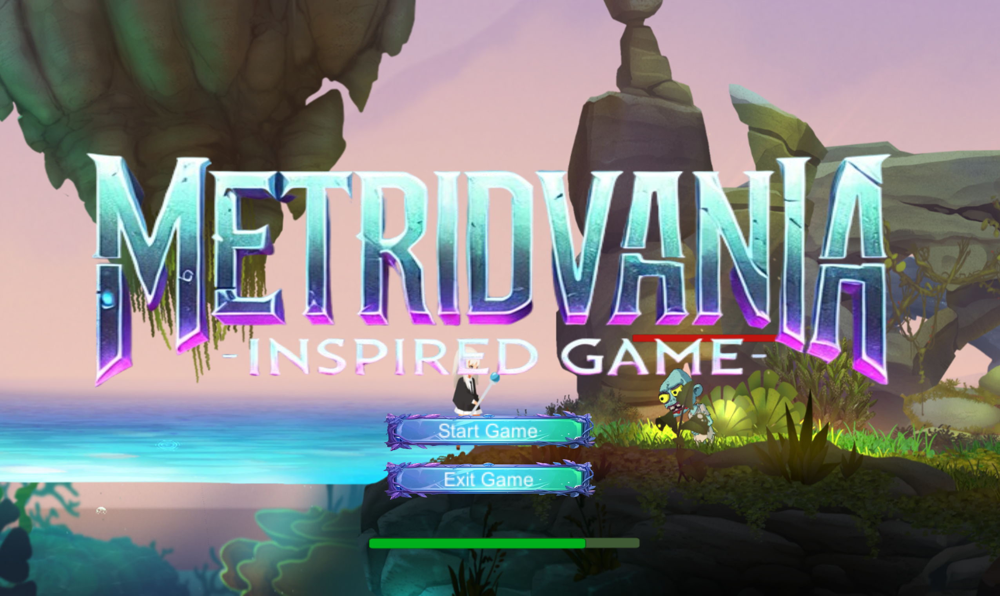
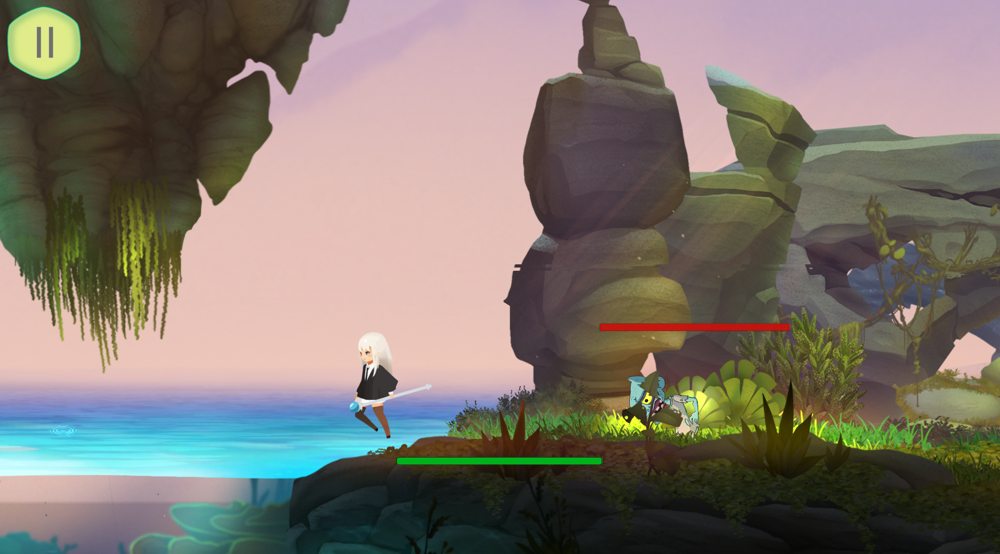
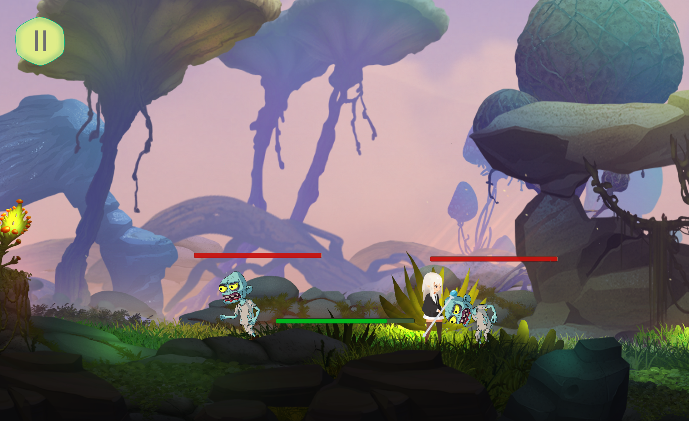
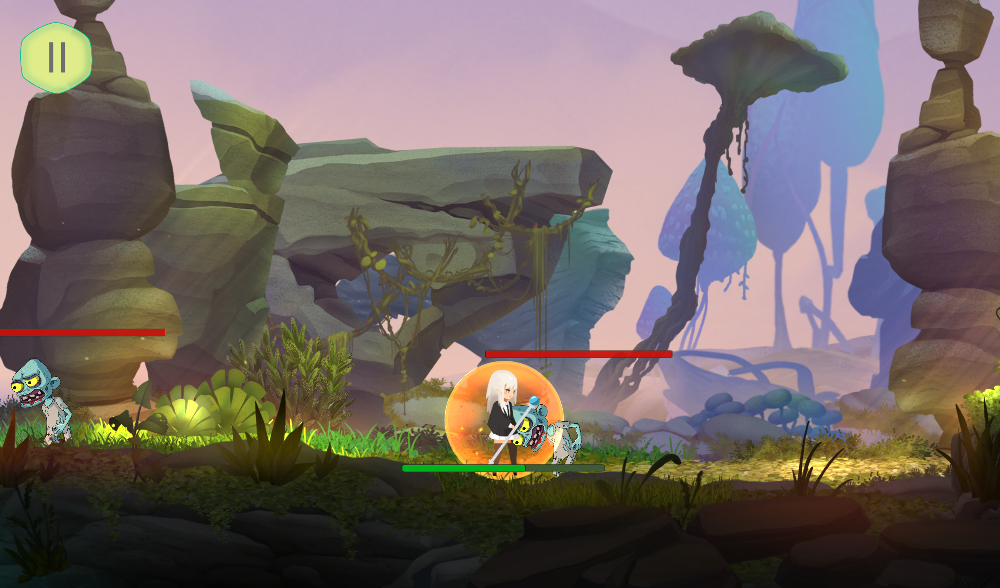
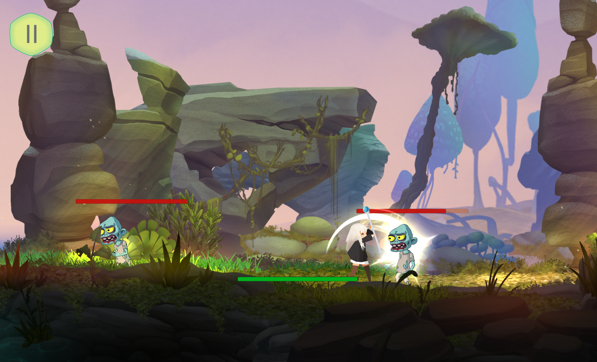
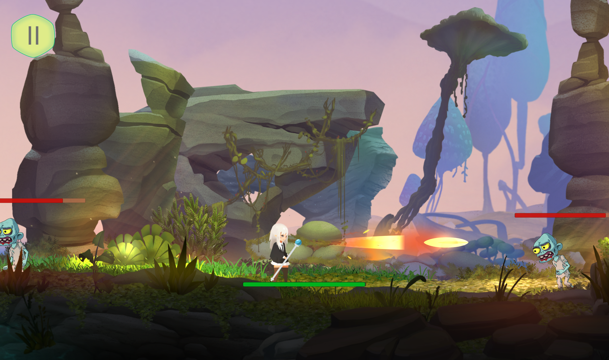
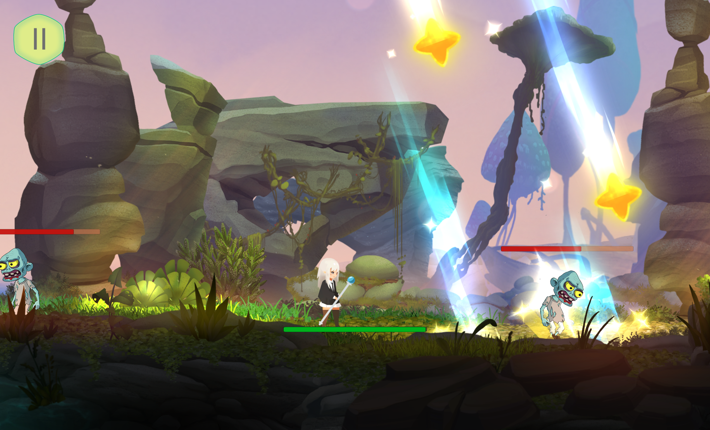

# 🎮 Game Title

**Metroidvania-Inspired-Game**

---

## 📺 Demo

- 🕹️ [Play it on Itch.io](https://aiyayayyah.itch.io/metroidvania-inspired-game)

---

## 🕹️ Controls

| Action          | Key         |
|-----------------|-------------|
| Move Left       | `A` or ⬅️   |
| Move Right      | `D` or ➡️   |
| Jump            | `Space`     |
| Dash            | `Shift`     |
| Shield          | `Q`         |
| Normal Attack   | `J`         |
| Skill 1         | `K`         |
| Skill 2         | `L`         |

---

## 🖼️ Screenshots

### Menu  
<figure>
    
  <figcaption><em>Main menu design and layout.</em></figcaption>
</figure>

### Player Dash  
<figure>
    
  <figcaption><em>Player performing a dash to evade danger.</em></figcaption>
</figure>

### Zombie Attack  
<figure>
    
  <figcaption><em>Zombie enemy initiating an attack on the player.</em></figcaption>
</figure>

### Level 3 Shield  
<figure>
    
  <figcaption><em>Player activating a shield for protection.</em></figcaption>
</figure>

### Close Range Attack  
<figure>
    
  <figcaption><em>Player delivering a melee strike to nearby enemies.</em></figcaption>
</figure>

### Launches a Straight Projectile  
<figure>
    
  <figcaption><em>Projectile launched in a straight line toward enemies.</em></figcaption>
</figure>

### AoE Attack That Damages Multiple Enemies  
<figure>
    
  <figcaption><em>Area-of-effect skill used to damage groups of enemies.</em></figcaption>
</figure>
